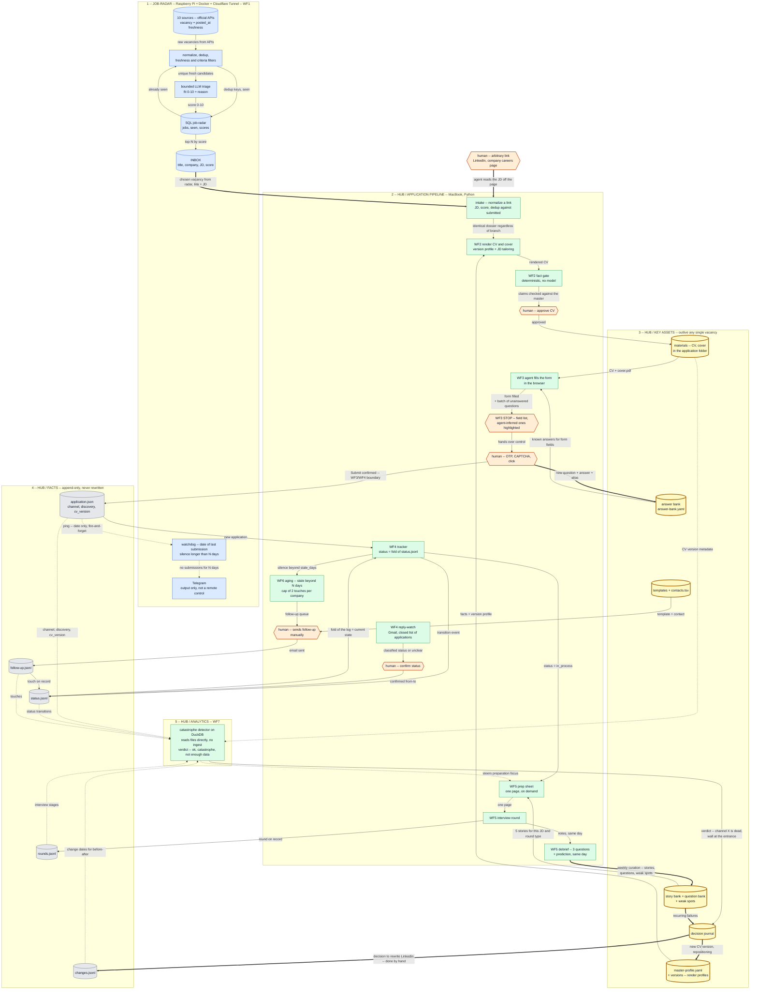

# Architecture

Two independent systems, one manual junction, one one-way notification back.



## Legend

| style | meaning |
|---|---|
| blue | job-radar on the Pi, WF1 |
| green | hub processes, WF2-WF7 |
| orange hexagon | human gate |
| yellow cylinder, thick border | key asset, outlives a single vacancy |
| grey cylinder | fact, append-only |
| thick arrow | feedback and learning |
| dashed | the engine reading files, or a notification — not a write |

## How to read it

**Band 2** is what happens to ONE vacancy, top to bottom.

**Band 3** is the six assets that accumulate between vacancies and make the
next application cheaper. This is what the system exists for: without them
every submission would cost as much as the first one.

**Band 4** is facts that are never rewritten.

**Band 5** reads 3 and 4, returns a verdict into the decision journal, and
that closes the loop back into `master-profile.yaml`.

The diagram holds 35 nodes. That is the readability ceiling; further detail
goes into prose, not into the picture.

---

# Stack

**Python + DuckDB. There is no persistent database.**

DuckDB here is a query engine, not a store. It reads JSONL and TSV straight
out of `data/`, so there is no ingest step — and with it, no schema to
migrate and no drift between files and a database. "Files are the truth"
holds by construction rather than by discipline.

SQLite was rejected deliberately: it is optimized for concurrent writes,
transactions and long-lived mutable state, none of which the hub has. What a
persistent `.db` would bring back is an ingest script and drift.

What DuckDB gives specifically here:

- `ASOF JOIN` — "what was this application's status at the moment the
  LinkedIn profile changed". The before-after slice becomes a single join.
- Full window functions plus `QUALIFY` for stage-by-stage funnels.
- `read_json_auto` / `read_csv_auto` — logs and `contacts.tsv` read as tables
  with no conversion.

**Cache.** If queries ever get slow — which starts around hundreds of
thousands of rows, i.e. never here — a `.duckdb` file can be materialized.
It stays in `.gitignore`, rebuilds with one command, and remains a cache
rather than a source of truth.

**When to revisit.** If a UI appears, or several processes start writing
concurrently, SQLite is the right answer — that is exactly what it is for.

---

# Runtime

## There is no scheduled daemon

Everything derived — `ghosted`, aging, the funnel, current status — is
computed at query time. Nothing needs to be computed on a schedule.

## The split is by the right to call a model

| part | what | how |
|---|---|---|
| deterministic core | queries, reports, digest, validation, fact gate | Python + DuckDB, **no model** |
| agentic edges | CV generation, form filling, email classification, question matching | Claude Code session, skills |

This is what operationalizes "LLM calls are bounded": the boundary runs
through code, not through a promise. What lives in the core physically
cannot call a model.

## A session opens with the digest

```
3 applications stale, time to nudge
1 debrief unwritten (Northwind, yesterday)
2 emails classified as unclear
Gmail: checked just now, 4 new events
last ping accepted by the Pi: 04.09
```

Email is checked **on demand** at session start: a day of latency changes
nothing for status tracking, so no daemon is needed. The nudge rides on an
action the human already wants to take.

## The watchdog lives on the Pi

A reminder about absence cannot live in the system the person has vanished
from: the Mac is off, or is being avoided, precisely when the signal matters.
The Pi is always on. This is a dead man's switch.

- The hub sends a **ping at confirmed Submit** — date only, fire-and-forget.
  Not at session start: a session without submissions is not activity, and
  that is exactly the case the watchdog must catch.
- The Pi stores **one number**, not a log. Analytics never reads it.
- Channel: Cloudflare Tunnel, authentication via an Access service token.
  An unauthenticated request never reaches the Pi at all.
- `snooze` always carries an expiry, and its delivery is confirmed. The final
  off switch is stopping the container on the Pi.

## Summary

| need | covered by |
|---|---|
| submitting, debriefs, confirming statuses | Claude Code session, skills |
| numbers, reports, validation | Python + DuckDB CLI, no model |
| checking email | on demand, at session start |
| aging, ghosted, funnel | computed at query time |
| "you disappeared" | watchdog on the Pi plus a ping on submission |
