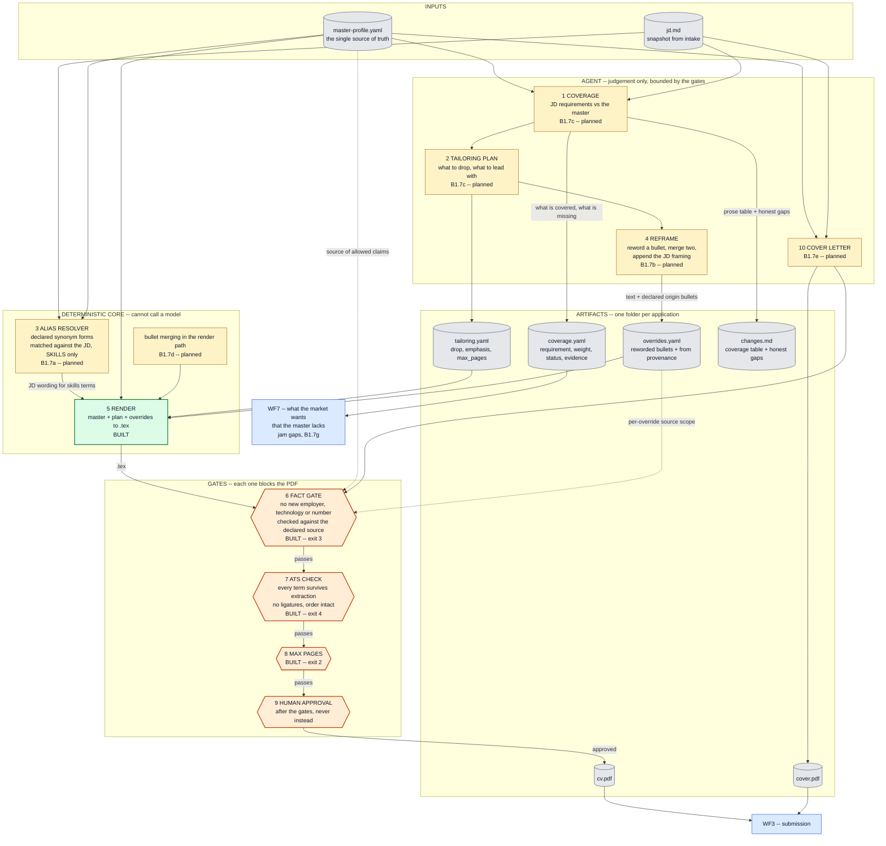

# WF2 — materials

The flow in full: what exists, what is planned, and what each gate is for.
Narrative and decisions live in [`workflows.md`](workflows.md) and
[`decisions.md`](decisions.md).

## Legend

| | |
|---|---|
| green | built and running today |
| amber | planned, with its roadmap task id |
| orange hexagon | a gate; each one blocks the PDF and has its own exit code |
| grey cylinder | an artifact written to the application folder |
| dashed arrow | a source the gate checks against, not an input to the render |

## What is built and what it costs

Three gates stand and the render works. Everything that fills the frame is
still to be written.

The gates are enforcement, not throughput: the fact gate would have caught one
fabrication in 29 real applications, and the ATS check passes on the current
toolchain, so it guards against a future font or template change rather than
fixing anything today.

## The cheap version

The most valuable single artifact is `coverage.yaml`, and it needs none of the
pipeline. Aggregated across applications it answers "what does the market ask
for that the master lacks" — the unit of observation is a requirement rather
than an application, so it works from the first submission, with no outcomes,
no gates and no renderer.

A minimum WF2 is therefore not the conveyor but making the tailoring skill
emit `coverage.yaml` and `tailoring.yaml` as a by-product of what it already
does.
